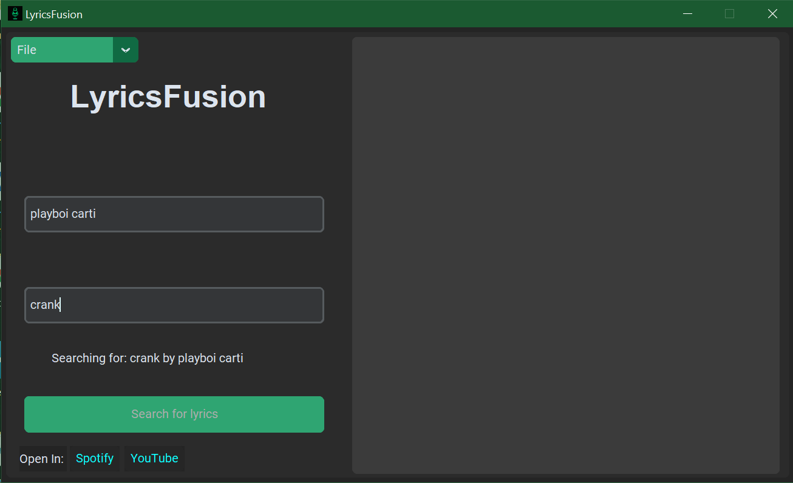
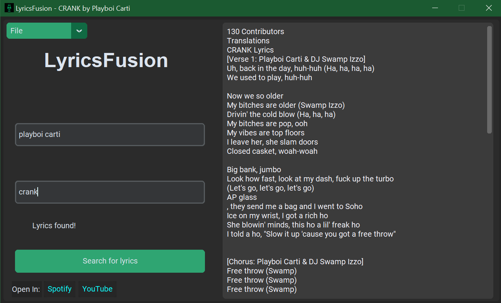

# 🎵 LyricsFusion

<p align="center">
  
</p>

**LyricsFusion** is a sleek desktop app built with Python and CustomTkinter that scrapes song lyrics straight from the web. Whether you're writing bars, analyzing lyrics, or building a music dataset—LyricsFusion fuses simplicity with power.

---

## 🚀 Features

- 🔍 Search for any song and instantly fetch lyrics
- 💾 Save your lyrics to local files
- 🧠 Clean UI built with `CustomTkinter`
- 🧵 Smooth performance using threaded scraping
- 🛠️ Compiled into a standalone `.exe` for Windows

---

## 🖼️ App Preview

| Search | Results |
|--------|---------|
|  |  |

---

## 🧩 Requirements (For source code usage)

- Python 3.10+
- Required libraries:
  ```bash
  pip install -r requirements.txt
